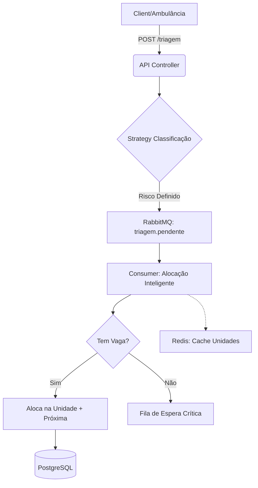

```markdown
# Sistema susflow - Regulação Inteligente de Urgências (SUS)
### Tech Challenge 5 - Hackathon | Pós-Graduação em Arquitetura e Desenvolvimento Java

---

## 📑 Índice

- [Sobre o Projeto](#-sobre-o-projeto)
- [Diferenciais de Arquitetura](#-diferenciais-de-arquitetura)
- [Tecnologias Utilizadas](#-tecnologias-utilizadas)
- [Arquitetura e Fluxo](#-arquitetura-e-fluxo)
- [Estrutura de Pastas](#-estrutura-de-pastas)
- [Como Executar](#-como-executar-o-projeto)
- [Endpoints da API](#-endpoints-da-api)
- [Critérios de Classificação de Risco](#-critérios-de-classificação-de-risco)
- [Documentação Interativa](#-documentação-interativa)
- [Monitoramento e Observabilidade](#-monitoramento-e-observabilidade)
- [Autores](#-autores)

---

## 📋 Sobre o Projeto

O **Sistema susflow** é uma solução de backend robusta desenvolvida para otimizar a regulação de urgências e emergências no SUS. O foco principal é a automação da triagem clínica e a alocação inteligente de pacientes baseada em **geolocalização e gravidade**.

### 🎯 O Problema
A regulação de leitos no SUS muitas vezes enfrenta atrasos devido a processos manuais. Em cenários de crise (ex: acidentes com múltiplas vítimas), a falta de um sistema resiliente pode levar à perda de dados críticos e atrasos fatais no socorro.

### 💡 A Solução
- ✅ **Triagem Automatizada:** Implementação do Protocolo de Manchester.
- ✅ **Regulação Geográfica:** Alocação automática na unidade de saúde mais próxima (UBS, UPA ou Hospital) com vaga disponível.
- ✅ **Resiliência:** Uso de mensageria para garantir que nenhum atendimento seja perdido em picos de demanda.

---

## 🌟 Diferenciais de Arquitetura

Para atingir o nível de maturidade exigido em sistemas críticos, implementamos:

1.  **Event-Driven Architecture (RabbitMQ):** Desacoplamento entre a triagem e a alocação. Em um acidente de ônibus, por exemplo, o sistema recebe centenas de requisições e as processa de forma ordenada sem travar.
2.  **Strategy Pattern:** Facilita a expansão do protocolo de triagem (ex: adicionar regras específicas para pandemias) sem alterar o código existente.
3.  **Cache Distribuído (Redis):** Otimização da busca geográfica de Unidades de Saúde, reduzindo a carga no banco de dados principal e garantindo respostas em microsegundos.
4.  **Fila de Espera Crítica:** Pacientes graves sem vaga imediata são movidos para uma fila prioritária monitorada por gestores em tempo real.

---

## 🛠️ Tecnologias Utilizadas

- **Java 21** & **Spring Boot 3.x**
- **PostgreSQL** (Persistência relacional)
- **H2 Database** (Desenvolvimento ágil)
- **RabbitMQ** (Mensageria e Resiliência)
- **Redis** (Cache de geolocalização)
- **Swagger/OpenAPI 3** (Documentação)
- **Docker & Docker Compose** (Containerização)
- **Spring Boot Actuator** (Observabilidade)

---

## 🏗️ Arquitetura e Fluxo



---

## 🚀 Como Executar o Projeto

### Opção 1: Docker Compose (Recomendado)

Esta opção sobe toda a infraestrutura (API, Postgres, RabbitMQ, Redis) de forma integrada.

1. **Gere o artefato da aplicação:**
```bash
mvn clean package -DskipTests

```


2. **Suba os containers:**
```bash
docker-compose up --build -d

```


3. **Acesse a API em:** `http://localhost:8080`

### Opção 2: Execução Local (Perfil Dev)

Utiliza o banco H2 em memória e requer que você tenha RabbitMQ e Redis rodando localmente (ou via Docker).

```bash
mvn spring-boot:run -Dspring-boot.run.profiles=dev

```

---

## 📡 Endpoints da API

### 👤 Gestão de Pacientes

| Método | Endpoint | Descrição |
| --- | --- | --- |
| `POST` | `/api/pacientes` | Registra um novo paciente (Valida CPF) |
| `GET` | `/api/pacientes/{id}` | Busca detalhes do paciente |
| `PUT` | `/api/pacientes` | Atualiza latitude/longitude |
| `GET` | `/api/pacientes/nome/{nome}` | Busca parcial por nome |

### 🚨 Triagem de Pacientes

| Método | Endpoint | Descrição |
| --- | --- | --- |
| `POST` | `/api/triagem` | Inicia triagem assíncrona baseada em sinais vitais |

**Exemplo de Request de Triagem:**

```json
{
  "cpfPaciente": "12345678901",
  "sintomas": "Dor no peito, falta de ar",
  "pressaoSistolica": 190,
  "pressaoDiastolica": 110,
  "temperatura": 37.0,
  "batimentos": 115,
  "saturacao": 88
}

```

---

## 📊 Critérios de Classificação de Risco

Baseado no Protocolo de Manchester simplificado:

| Parâmetro | Emergência (Vermelho) | Muito Urgente (Laranja) |
| --- | --- | --- |
| **Saturação O₂** | < 90% | 90% - 92% |
| **Pressão Sist.** | > 180 mmHg | 160 - 179 mmHg |
| **Temperatura** | > 39.5°C | 38.5 - 39.4°C |

---

## 📖 Documentação Interativa

Acesse o Swagger UI para testar os endpoints em tempo real:
👉 [http://localhost:8080/swagger-ui.html](https://www.google.com/search?q=http://localhost:8080/swagger-ui.html)

---

## 📈 Monitoramento e Observabilidade

A aplicação expõe métricas de saúde e performance via Spring Actuator:

* **Health Check:** `http://localhost:8080/actuator/health`
* **Métricas:** `http://localhost:8080/actuator/metrics`

---

## 👥 Autores

* **Leonardo Felipe Ventura Ferreira** - RM363339
* **Wagner de Lima Braga Silva** - RM364223
* **Everton Cristiano de Souza Teixeira** - RM362065

---