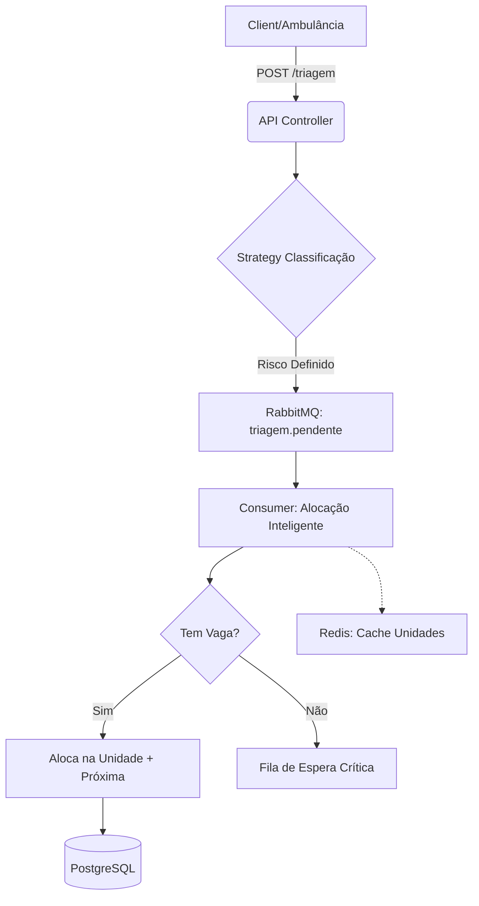

```markdown
# Sistema susflow - Regulação Inteligente de Urgências (SUS)
### Tech Challenge 5 - Hackathon | Pós-Graduação em Arquitetura e Desenvolvimento Java

---

## 📑 Índice

- [Sobre o Projeto](#-sobre-o-projeto)
- [Diferenciais de Arquitetura](#-diferenciais-de-arquitetura)
- [Tecnologias Utilizadas](#-tecnologias-utilizadas)
- [Arquitetura e Fluxo](#-arquitetura-e-fluxo)
- [Estrutura de Pastas](#-estrutura-de-pastas)
- [Como Executar](#-como-executar-o-projeto)
- [Endpoints da API](#-endpoints-da-api)
- [Critérios de Classificação de Risco](#-critérios-de-classificação-de-risco)
- [Documentação Interativa](#-documentação-interativa)
- [Monitoramento e Observabilidade](#-monitoramento-e-observabilidade)
- [Autores](#-autores)

---

## 📑 Índice

- [Sobre o Projeto](#-sobre-o-projeto)
- [Tecnologias Utilizadas](#-tecnologias-utilizadas)
- [Arquitetura](#-arquitetura)
- [Pré-requisitos](#-pré-requisitos)
- [Como Executar](#-como-executar-o-projeto)
- [Endpoints da API](#-endpoints-da-api)
  - [Health Check](#-health-check)
  - [Gestão de Pacientes](#-gestão-de-pacientes)
  - [Triagem de Pacientes](#-triagem-de-pacientes)
  - [Critérios de Classificação](#-critérios-de-classificação-de-risco)
- [Documentação Interativa](#-documentação-interativa)
- [Testando a API](#-testando-a-api)
- [Segurança](#-segurança)
- [Contribuindo](#-contribuindo)

---

## 📋 Sobre o Projeto

O **Sistema susflow** é uma solução de backend robusta desenvolvida para otimizar a regulação de urgências e emergências no SUS. O foco principal é a automação da triagem clínica e a alocação inteligente de pacientes baseada em **geolocalização e gravidade**.

### 🎯 O Problema
A regulação de leitos no SUS muitas vezes enfrenta atrasos devido a processos manuais. Em cenários de crise (ex: acidentes com múltiplas vítimas), a falta de um sistema resiliente pode levar à perda de dados críticos e atrasos fatais no socorro.

### 💡 A Solução
- ✅ **Triagem Automatizada:** Implementação do Protocolo de Manchester.
- ✅ **Regulação Geográfica:** Alocação automática na unidade de saúde mais próxima (UBS, UPA ou Hospital) com vaga disponível.
- ✅ **Resiliência:** Uso de mensageria para garantir que nenhum atendimento seja perdido em picos de demanda.
O sistema visa resolver o problema de **triagem e acolhimento inteligente** nas unidades de saúde do SUS, auxiliando na:

- ✅ **Priorização de atendimentos** com base na gravidade dos sintomas
- ✅ **Redução da superlotação** através de direcionamento eficiente
- ✅ **Atendimento rápido** para pacientes em situação de emergência
- ✅ **Melhoria da eficiência operacional** dos profissionais de saúde
- ✅ **Transparência** no processo de triagem e atendimento
- ✅ **Melhor experiência** para pacientes e colaboradores do SUS

### 💡 Solução Proposta

Sistema backend robusto que implementa:
- Classificação automática de risco baseada em sintomas e sinais vitais
- Priorização inteligente de atendimentos seguindo protocolos médicos
- API RESTful para integração com diferentes front-ends

### 🛠️ Tecnologias Utilizadas

- ☕ **Java 21** - Linguagem de programação
- 🍃 **Spring Boot 3.x** - Framework principal
  - Spring Web - APIs REST
  - Spring Data JPA - Persistência de dados
  - Spring Validation - Validação de dados
- 📊 **PostgreSQL** - Banco de dados principal (produção)
- 💾 **H2 Database** - Banco de dados em memória (desenvolvimento)
- 🐰 **RabbitMQ** - Sistema de mensageria
- 📝 **Swagger/OpenAPI 3** - Documentação da API
- 🐳 **Docker & Docker Compose** - Containerização
- 🔧 **Maven** - Gerenciamento de dependências

### 🏗️ Arquitetura

O projeto segue uma arquitetura em camadas:

```
┌─────────────────────────────────────────┐
│          Controller Layer               │ ← REST API Endpoints
│  (PacienteController, TriagemController)│
└──────────────┬──────────────────────────┘
               │
┌──────────────▼──────────────────────────┐
│           Service Layer                 │ ← Lógica de Negócio
│   (PacienteService, TriagemService)     │
└──────────────┬──────────────────────────┘
               │
┌──────────────▼──────────────────────────┐
│         Repository Layer                │ ← Acesso a Dados
│  (PacienteRepository, TriagemRepository)│
└──────────────┬──────────────────────────┘
               │
┌──────────────▼──────────────────────────┐
│          Database Layer                 │ ← PostgreSQL/H2
│         (JPA Entities)                  │
└─────────────────────────────────────────┘
```

### 📁 Estrutura de Pastas

```
sus-triage-api/
├── src/
│   ├── main/
│   │   ├── java/com/tech/sus_triage_api/
│   │   │   ├── config/              # Configurações (RabbitMQ, Swagger)
│   │   │   ├── controller/          # Controllers REST
│   │   │   │   ├── paciente/        # Endpoints de Paciente
│   │   │   │   │   └── doc/         # Documentação Swagger
│   │   │   │   └── triagem/         # Endpoints de Triagem
│   │   │   │       └── doc/         # Documentação Swagger
│   │   │   ├── domain/              # Entidades de Domínio
│   │   │   │   ├── paciente/
│   │   │   │   ├── triagem/
│   │   │   │   ├── unidadesaude/
│   │   │   │   └── enums/           # Enumerações (Risco, Status)
│   │   │   ├── dto/                 # Data Transfer Objects
│   │   │   ├── entities/            # Entidades JPA
│   │   │   ├── repository/          # Repositories JPA
│   │   │   ├── service/             # Lógica de Negócio
│   │   │   │   ├── paciente/
│   │   │   │   ├── rabbitmq/        # Mensageria
│   │   │   │   └── strategy/        # Estratégias de Classificação
│   │   │   └── errors/              # Tratamento de Exceções
│   │   └── resources/
│   │       ├── application.yml      # Configuração padrão
│   │       ├── application-dev.yml  # Configuração desenvolvimento
│   │       ├── application-prod.yml # Configuração produção
│   │       ├── schema-*.sql         # Scripts de criação de tabelas
│   │       └── data-*.sql           # Scripts de dados iniciais
│   └── test/                        # Testes unitários e integração
├── docker-compose.yml               # Orquestração de containers
├── Dockerfile                       # Build da imagem Docker
├── pom.xml                          # Dependências Maven
└── README.md                        # Documentação do projeto
```

### 🔄 Fluxo de Dados

1. **Cliente** → Faz requisição HTTP para a API
2. **Controller** → Recebe e valida a requisição
3. **Service** → Processa a lógica de negócio (classificação de risco)
4. **Repository** → Persiste ou recupera dados
5. **Response** → Retorna resultado ao cliente

---

## 🌟 Diferenciais de Arquitetura

Para atingir o nível de maturidade exigido em sistemas críticos, implementamos:

1.  **Event-Driven Architecture (RabbitMQ):** Desacoplamento entre a triagem e a alocação. Em um acidente de ônibus, por exemplo, o sistema recebe centenas de requisições e as processa de forma ordenada sem travar.
2.  **Strategy Pattern:** Facilita a expansão do protocolo de triagem (ex: adicionar regras específicas para pandemias) sem alterar o código existente.
3.  **Cache Distribuído (Redis):** Otimização da busca geográfica de Unidades de Saúde, reduzindo a carga no banco de dados principal e garantindo respostas em microsegundos.
4.  **Fila de Espera Crítica:** Pacientes graves sem vaga imediata são movidos para uma fila prioritária monitorada por gestores em tempo real.

---

## 🛠️ Tecnologias Utilizadas

- **Java 21** & **Spring Boot 3.x**
- **PostgreSQL** (Persistência relacional)
- **H2 Database** (Desenvolvimento ágil)
- **RabbitMQ** (Mensageria e Resiliência)
- **Redis** (Cache de geolocalização)
- **Swagger/OpenAPI 3** (Documentação)
- **Docker & Docker Compose** (Containerização)
- **Spring Boot Actuator** (Observabilidade)

---

## 🏗️ Arquitetura e Fluxo



---

## 🚀 Como Executar o Projeto

### Opção 1: Docker Compose (Recomendado)

Esta opção sobe toda a infraestrutura (API, Postgres, RabbitMQ, Redis) de forma integrada.

1. **Gere o artefato da aplicação:**
```bash
mvn clean package -DskipTests

```


2. **Suba os containers:**
```bash
docker-compose up --build -d

```


3. **Acesse a API em:** `http://localhost:8080`

### Opção 2: Execução Local (Perfil Dev)

Utiliza o banco H2 em memória e requer que você tenha RabbitMQ e Redis rodando localmente (ou via Docker).

```bash
mvn spring-boot:run -Dspring-boot.run.profiles=dev

```

---

## 📡 Endpoints da API

### 👤 Gestão de Pacientes

| Método | Endpoint | Descrição |
| --- | --- | --- |
| `POST` | `/api/pacientes` | Registra um novo paciente (Valida CPF) |
| `GET` | `/api/pacientes/{id}` | Busca detalhes do paciente |
| `PUT` | `/api/pacientes` | Atualiza latitude/longitude |
| `GET` | `/api/pacientes/nome/{nome}` | Busca parcial por nome |

### 🚨 Triagem de Pacientes

| Método | Endpoint | Descrição |
| --- | --- | --- |
| `POST` | `/api/triagem` | Inicia triagem assíncrona baseada em sinais vitais |

**Exemplo de Request de Triagem:**

```json
{
  "cpfPaciente": "12345678901",
  "sintomas": "Dor no peito, falta de ar",
  "pressaoSistolica": 190,
  "pressaoDiastolica": 110,
  "temperatura": 37.0,
  "batimentos": 115,
  "saturacao": 88
### 🏥 Health Check

**Endpoint:** `GET /actuator/health`

**Descrição:** Verifica o status de saúde da aplicação

**Resposta:**
```json
{
  "status": "UP"
}
```

```

---

## 📊 Critérios de Classificação de Risco

Baseado no Protocolo de Manchester simplificado:

| Parâmetro | Emergência (Vermelho) | Muito Urgente (Laranja) |
| --- | --- | --- |
| **Saturação O₂** | < 90% | 90% - 92% |
| **Pressão Sist.** | > 180 mmHg | 160 - 179 mmHg |
| **Temperatura** | > 39.5°C | 38.5 - 39.4°C |

---

## 📖 Documentação Interativa

Acesse o Swagger UI para testar os endpoints em tempo real:
👉 [http://localhost:8080/swagger-ui.html](https://www.google.com/search?q=http://localhost:8080/swagger-ui.html)

---

## 📈 Monitoramento e Observabilidade

A aplicação expõe métricas de saúde e performance via Spring Actuator:

* **Health Check:** `http://localhost:8080/actuator/health`
* **Métricas:** `http://localhost:8080/actuator/metrics`

---

## 👥 Autores

* **Leonardo Felipe Ventura Ferreira** - RM363339
* **Wagner de Lima Braga Silva** - RM364223
* **Everton Cristiano de Souza Teixeira** - RM362065

---
---

### 👤 Gestão de Pacientes

#### 1. Criar Novo Paciente

**Endpoint:** `POST /api/pacientes`

**Descrição:** Registra um novo paciente no sistema

**Request Body:**
```json
{
  "nome": "João Silva",
  "cpf": "123.456.789-00",
  "latitude": -23.5505,
  "longitude": -46.6333
}
```

**Validações:**
- `nome`: obrigatório, máximo 50 caracteres
- `cpf`: obrigatório, formato válido
- `latitude`: opcional
- `longitude`: opcional

**Resposta (201 Created):**
```json
{
  "id": "1",
  "nome": "João Silva",
  "cpf": "123.456.789-00",
  "latitude": -23.5505,
  "longitude": -46.6333
}
```

**Erros Possíveis:**
- `400 Bad Request`: Dados inválidos ou CPF já cadastrado
- `500 Internal Server Error`: Erro no servidor

---

#### 2. Obter Paciente por ID

**Endpoint:** `GET /api/pacientes/{id}`

**Descrição:** Obtém os detalhes de um paciente específico

**Exemplo:** `GET /api/pacientes/1`

**Resposta (200 OK):**
```json
{
  "id": "1",
  "nome": "João Silva",
  "cpf": "123.456.789-00",
  "latitude": -23.5505,
  "longitude": -46.6333
}
```

**Erros Possíveis:**
- `404 Not Found`: Paciente não encontrado

---

#### 3. Atualizar Coordenadas do Paciente

**Endpoint:** `PUT /api/pacientes`

**Descrição:** Atualiza a localização (latitude e longitude) de um paciente

**Request Body:**
```json
{
  "id": 1,
  "latitude": -23.5505,
  "longitude": -46.6333
}
```

**Validações:**
- `id`: obrigatório
- `latitude`: obrigatória
- `longitude`: obrigatória

**Resposta (200 OK):**
```json
{
  "id": "1",
  "nome": "João Silva",
  "cpf": "123.456.789-00",
  "latitude": -23.5505,
  "longitude": -46.6333
}
```

**Erros Possíveis:**
- `400 Bad Request`: Dados inválidos
- `404 Not Found`: Paciente não encontrado

---

#### 4. Buscar Pacientes por Nome

**Endpoint:** `GET /api/pacientes/nome/{nome}`

**Descrição:** Busca pacientes pelo nome (busca parcial, case-insensitive)

**Exemplo:** `GET /api/pacientes/nome/João`

**Resposta (200 OK):**
```json
[
  {
    "id": "1",
    "nome": "João Silva",
    "cpf": "123.456.789-00",
    "latitude": -23.5505,
    "longitude": -46.6333
  },
  {
    "id": "3",
    "nome": "João Santos",
    "cpf": "987.654.321-00",
    "latitude": -23.5510,
    "longitude": -46.6340
  }
]
```

**Erros Possíveis:**
- `400 Bad Request`: Nome vazio
- `404 Not Found`: Nenhum paciente encontrado

---

### 🚨 Triagem de Pacientes

#### Realizar Triagem

**Endpoint:** `POST /api/triagem`

**Descrição:** Realiza a triagem de um paciente com base nos sinais vitais e sintomas. O sistema classifica automaticamente o nível de risco (Vermelho, Laranja, Amarelo ou Verde) e aloca para a unidade de saúde mais próxima.

**Request Body:**
```json
{
  "nomePaciente": "João Silva",
  "cpfPaciente": "123.456.789-00",
  "latitude": -23.5505,
  "longitude": -46.6333,
  "sintomas": "Febre alta, dor de cabeça intensa",
  "pressaoSistolica": 140,
  "pressaoDiastolica": 90,
  "temperatura": 39.5,
  "batimentos": 110,
  "saturacao": 92
}
```

**Classificação de Risco:**
- 🔴 **VERMELHO** - Emergência (atendimento imediato)
- 🟠 **LARANJA** - Muito urgente (atendimento em até 10 minutos)
- 🟡 **AMARELO** - Urgente (atendimento em até 60 minutos)
- 🟢 **VERDE** - Pouco urgente (atendimento em até 120 minutos)

**Resposta (200 OK):**
```json
{
  "id": 1,
  "paciente": {
    "id": 1,
    "nome": "João Silva",
    "cpf": "123.456.789-00",
    "latitude": -23.5505,
    "longitude": -46.6333
  },
  "sintomas": "Febre alta, dor de cabeça intensa",
  "pressaoArterialSistolica": 140,
  "pressaoArterialDiastolica": 90,
  "temperatura": 39.5,
  "batimentosPorMinuto": 110,
  "saturacaoOxigenio": 92,
  "risco": "VERMELHO",
  "status": "PENDENTE_ALOCACAO",
  "dataHora": "2026-02-09T10:30:00",
  "unidadeDestino": null
}
```

**Erros Possíveis:**
- `400 Bad Request`: Dados inválidos ou sinais vitais fora dos padrões
- `404 Not Found`: Paciente não encontrado ou nenhuma unidade disponível
- `500 Internal Server Error`: Erro no processamento da triagem

---

### 📊 Critérios de Classificação de Risco

O sistema utiliza os seguintes parâmetros para classificação:

| Parâmetro | Faixa Normal | Risco Elevado |
|-----------|--------------|---------------|
| **Pressão Sistólica** | 90-139 mmHg | < 90 ou > 180 mmHg |
| **Pressão Diastólica** | 60-89 mmHg | < 60 ou > 110 mmHg |
| **Temperatura** | 36.1-37.2°C | < 35°C ou > 39°C |
| **Batimentos** | 60-100 bpm | < 50 ou > 120 bpm |
| **Saturação O₂** | 95-100% | < 90% |

---

### 📖 Documentação Interativa

Acesse a documentação interativa completa da API através do Swagger UI:

**URL:** [http://localhost:8080/swagger-ui.html](http://localhost:8080/swagger-ui.html)

O Swagger UI oferece:
- ✅ Documentação completa de todos os endpoints
- ✅ Possibilidade de testar os endpoints diretamente
- ✅ Exemplos de request/response
- ✅ Validações e códigos de erro
- ✅ Schemas dos DTOs

---

### 📋 Resumo Rápido dos Endpoints

| Método | Endpoint | Descrição |
|--------|----------|-----------|
| 🟢 GET | `/actuator/health` | Verifica saúde da aplicação |
| 🟢 POST | `/api/pacientes` | Criar novo paciente |
| 🟢 GET | `/api/pacientes/{id}` | Obter paciente por ID |
| 🟣 PUT | `/api/pacientes` | Atualizar coordenadas do paciente |
| 🟢 GET | `/api/pacientes/nome/{nome}` | Buscar pacientes por nome |
| 🟢 POST | `/api/triagem` | Realizar triagem de paciente |

---

### 🧪 Testando a API

#### Usando cURL

**Criar Paciente:**
```bash
curl -X POST http://localhost:8080/api/pacientes \
  -H "Content-Type: application/json" \
  -d '{
    "nome": "Maria Silva",
    "cpf": "123.456.789-00",
    "latitude": -23.5505,
    "longitude": -46.6333
  }'
```

**Buscar Paciente por Nome:**
```bash
curl -X GET http://localhost:8080/api/pacientes/nome/Maria
```

**Atualizar Coordenadas:**
```bash
curl -X PUT http://localhost:8080/api/pacientes \
  -H "Content-Type: application/json" \
  -d '{
    "id": 1,
    "latitude": -23.5510,
    "longitude": -46.6340
  }'
```

**Realizar Triagem:**
```bash
curl -X POST http://localhost:8080/api/triagem \
  -H "Content-Type: application/json" \
  -d '{
    "nomePaciente": "Maria Silva",
    "cpfPaciente": "123.456.789-00",
    "latitude": -23.5505,
    "longitude": -46.6333,
    "sintomas": "Febre alta",
    "pressaoSistolica": 140,
    "pressaoDiastolica": 90,
    "temperatura": 39.5,
    "batimentos": 110,
    "saturacao": 92
  }'
```

---

### 🔐 Segurança

**Validações Implementadas:**
- ✅ Validação de CPF
- ✅ Validação de campos obrigatórios
- ✅ Validação de tamanho de strings
- ✅ Validação de sinais vitais
- ✅ Tratamento de exceções customizado

**Próximas Implementações:**
- 🔒 Autenticação JWT
- 🔒 Autorização baseada em roles
- 🔒 Rate limiting
- 🔒 CORS configurável

---

### 📊 Monitoramento

**Spring Boot Actuator:**
- `/actuator/health` - Status da aplicação
- `/actuator/info` - Informações da aplicação
- `/actuator/metrics` - Métricas da aplicação

---

### 🤝 Contribuindo

1. Fork o projeto
2. Crie uma branch para sua feature (`git checkout -b feature/nova-funcionalidade`)
3. Commit suas mudanças (`git commit -m 'Adiciona nova funcionalidade'`)
4. Push para a branch (`git push origin feature/nova-funcionalidade`)
5. Abra um Pull Request

---

### 📝 Licença

Este projeto foi desenvolvido para fins educacionais como parte do Tech Challenge 5 - Hackathon da FIAP.

---

### 👥 Autores

Desenvolvido por estudantes da Pós-Graduação em Arquitetura e Desenvolvimento Java - FIAP

| Nome | RM |
|------|-----|
| Leonardo Felipe Ventura Ferreira | RM363339 |
| Wagner de Lima Braga Silva | RM364223 |
| Everton Cristiano de Souza Teixeira | RM362065 |

---

### 📞 Suporte

Para dúvidas ou sugestões:
- 📧 Email: [leoventura245@gmail.com]
- 📧 Email: [wagner.sistemalima@gmail.com]
- 📧 Email: [evertoncsouza@gmail.com]
- 🐛 Issues: [GitHub Issues](https://github.com/BL7Ki/sus-triage-api/issues)

---

**Feito com ❤️ e ☕ para melhorar o atendimento no SUS**
# Opção 3: Com Docker Compose (Recomendado para Produção)

## 1. Gerar o build do projeto
Antes de subir os serviços, gere o artefato `.jar` do projeto:
```bash
mvn clean package -DskipTests
```

## 2. Subir todos os serviços com imagems pré-construídas
```bash
docker-compose up --build -d
```
## 3. Ver logs em tempo real
```bash
docker-compose logs -f sus-triage-api
```
## 4. Verificar status dos serviços
```bash
docker-compose ps
```
## 5. Parar serviços
```bash
docker-compose down
```

## URLs para acessar a aplicação
- API: http://localhost:8080/api
- Health Check: http://localhost:8080/actuator/health
- Swagger UI (se configurado): http://localhost:8080/swagger-ui.html
       
